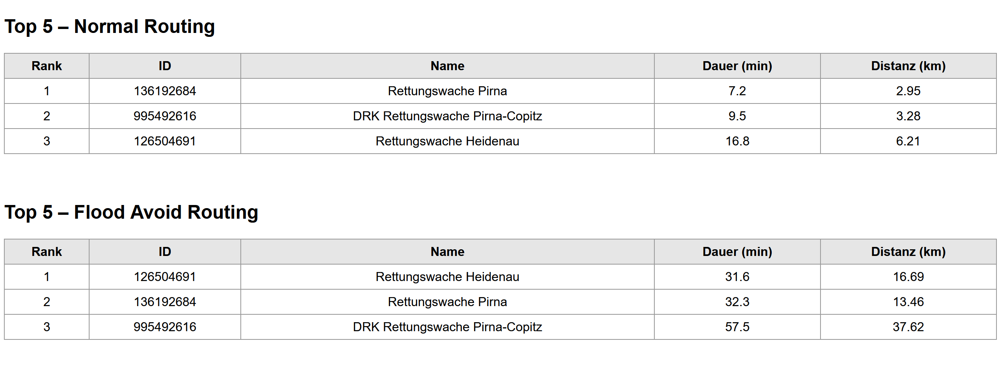
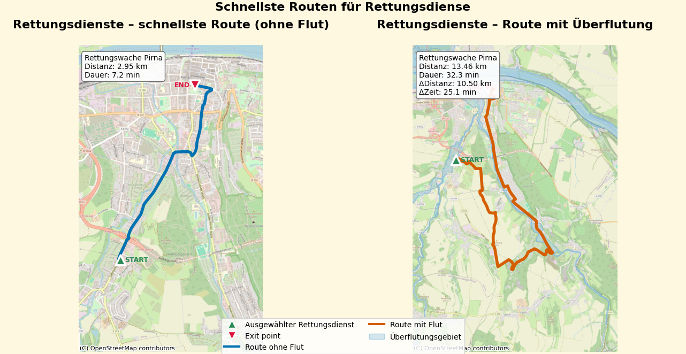
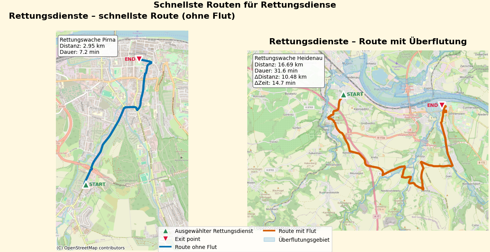
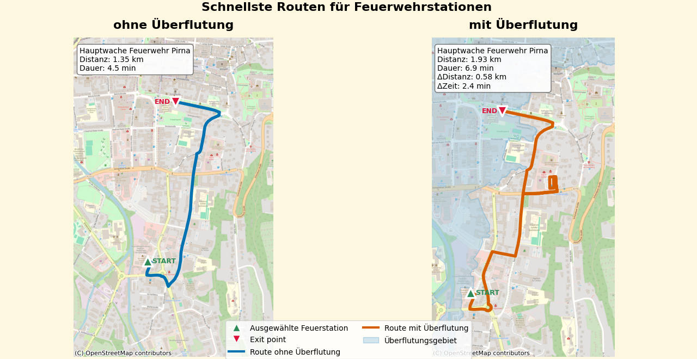

---
# Zuständigkeit für Routing bei Hochwasser

**Milan Barth, Sascha Wegert**  
Geographisches Institut, Universität Heidelberg

## Einleitung

Hochwasserereignisse treten zunehmend häufiger auf und fallen dabei oft schwerwiegender aus – insbesondere in Regionen entlang großer Flüsse wie der Elbe. Während der Fokus in der öffentlichen und wissenschaftlichen Diskussion häufig auf der Vorhersage von Ausmaß und Eintrittswahrscheinlichkeit liegt, werden die konkreten Auswirkungen auf
 Infrastruktur und Erreichbarkeit oft unterschätzt.
Während eines Hochwassers können Straßen und Brücken teilweise oder vollständig unpassierbar werden. Was normalerweise ein kurzer und direkter Weg ist, kann sich schnell in einen langen Umweg verwandeln oder sogar unzugänglich werden. Das beeinträchtigt direkt die Reaktionsgeschwindigkeit von Rettungsdiensten und Feuerwehr aus, d. h. darauf, wie schnell diese im betroffenen Gebiet sein können.
Unter normalen Bedingungen ist die Notfallreaktion relativ unkompliziert: Wenn ein Notruf eingeht, wird die nächt verfügbare Einheit zum Einsatzort geschickt. In Katastrophensituationen, wie beispielsweise extremen Hochwassern, verlagert sich die Koordination jedoch auf regionale Behörden. Diese verwalten die Ressourcen über die Gemeinden hinweg und müssen schnell auf sich ändernde Bedingungen reagieren.
Dies wirft die wichtige Frage auf:
Können solche Störungen im Voraus erkannt werden, um die Planung für Extremereignisse zu verbessern?
In diesem Projekt untersuchen wir, welche Auswirkungen Hochwasserereignisse auf die Erreichbarkeit von Rettungsdiensten in der Elbe-Region haben. Dabei haben wir uns auf die Gemeinden Pirna konzentriert. Dieses Gebiet ist aufgrund seiner Nähe zur Elbe besonders gefährdet. Dies haben die Elbe Hochwasserereignisse von 2002 und 2013 gezeigt.
Ein wichtiger Maßstab für die Bewertung der Notfallhilfe in Sachsen ist die gesetzlich festgelegte Hilfsfrist von maximal zwölf Minuten. Sie umfasst das Notrufgespräch, die Ausrückzeit und die reine Fahrzeit, welche in der Regel zehn Minuten beträgt.
Unsere Analyse fokussiert sich auf diese Komponente und untersucht, welche Auswirkungen Hochwasser auf die Einhaltung dieser Frist hat. Das Ziel besteht darin, zu zeigen, dass Störungen, die durch Hochwasser verursacht werden, die Fahrzeit stark verlängern können. Zudem soll aufgezeigt werden, dass vorausschauende Einsatzplanung, die Hochwasser berücksichtigen, die Entscheidungen in Notfällen verbessern könnten.

## Methode
Um die Auswirkungen von Überschwemmungen zu analysieren, wurde schrittweise vorgegangen. Der Schwerpunkt lag dabei auf der betroffenen Bevölkerung und ihrer Erreichbarkeit.
Zunächst wurden innerhalb der ausgewählten Gemeinde diejenigen Gebiete identifiziert, die bewohnt sind und von Überschwemmungen betroffen sein können. So kann sich im weiteren Verlauf auf jene Orte konzentriert werden, an denen Menschen während eines Hochwasserereignisses betroffen sind und wahrscheinlich Hilfe benötigen.
Aus diesem Gebiet wurde der kritischste Fall ausgewählt – die überschwemmte Fläche mit der höchsten Einwohnerzahl – und als Beispielszenario für die weitere Analyse herangezogen.
Da Rettungsdienste in überschwemmten Gebieten nicht operieren können, wird ein „Ausgangspunkt“ an der Grenze des Überschwemmungsgebiets festgelegt. Dieser stellt den nächstgelegenen, zugänglichen Punkt in der Mitte der Fläche dar, von dem aus die Rettungsdienste die betroffene Bevölkerung erreichen können. Dabei wurde darauf geachtet, dass dieser Punkt tatsächlich an das umliegende Straßennetz angebunden ist und nicht innerhalb des Überschwemmungsgebiets isoliert liegt.
Anschließend wurden die nahegelegenen Rettungsdienste und Feuerwehrwachen ermittelt. Um die Analyse auf realistische Einsatzmöglichkeiten zu beschränken, haben wir nur Einrichtungen berücksichtigt, die unter normalen Bedingungen innerhalb einer Fahrzeit von 15 Minuten erreichbar sind.
Aus diesen wählten wir für die Rettungsdienste und die Feuerwehr jeweils die fünf nächstgelegenen Einrichtungen aus, um sicherzustellen, dass die relevantesten Standorte der Einsatzkräfte in die Analyse einbezogen werden.
Schließlich haben wir die Routen von diesen Standorten zum Evakuierungsort unter zwei Bedingungen berechnet.
Zum einen das Routing unter normalen Bedingungen und zum anderen das Routing bei Hochwasser, bei dem die überfluteten Gebiete umfahren werden.
Durch den Vergleich der Fahrstrecken und Fahrzeiten dieser beiden Szenarien lässt sich beurteilen, inwieweit sich die Fahrzeit durch Hochwasser verlängert und welche Standorte den Evakuierungsort am schnellsten erreichen würden.

## Ergebnisse
Die Analyse zeigt, dass Überschwemmungen einen eindeutigen und messbaren Einfluss auf die Notfallversorgung haben. Unter normalen Umständen ist die nächstgelegene Rettungs- oder Feuerwehrstation in der Regel die schnellste Option. Berücksichtigt man jedoch überschwemmte Gebiete, kann sich dies erheblich ändern.
Wie zu erwarten war, führen Überschwemmungen zu erheblichen Umwegen, wodurch sich die Fahrzeiten verlängern und die zurückzulegenden Strecken größer werden. Dieser Effekt wird insbesondere durch den starken Anstieg der Fahrzeiten in Tabelle 1 deutlich.
Unter normalen Bedingungen können die Rettungswachen in Pirna das betroffene Gebiet in weniger als zehn Minuten erreichen. Bei Hochwasser steigen die Fahrzeiten jedoch auf über 30 Minuten an.
Dies zeigt, dass Strecken, die normalerweise kurz und direkt sind, bei Hochwasser oft erhebliche Umwege erfordern.
Im Zusammenhang mit der gesetzlich festgelegten „Hilfsfrist“ von etwa zehn Minuten werden solche Verlängerungen kritisch.
			
Rangwechsel der Rettungswachen bei Hochwasser in Pirna 

Tabelle 1: Vergleich der Routing-Ergebnisse für die Rettungswachen in Heidenau. Dargestellt sind Veränderungen in Fahrtdauer, Strecke und Reihenfolge der schnellsten Verbindungen (eigene Darstellung)

Eine der wichtigsten Erkenntnisse ist, dass sich durch Überschwemmungen ändern kann, welche Rettungsdienststelle tatsächlich am schnellsten vor Ort ist. Abbildung 1 zeigt die Veränderung der ursprünglich schnellsten Route der Rettungswache Pirna bei Hochwasser. Während diese unter normalen Bedingungen eine direkte Verbindung mit einer Fahrzeit von etwa sieben Minuten hat, ist sie aufgrund überfluteter Straßen nicht mehr befahrbar und erfordert einen erheblichen Umweg. Dadurch verlängert sich die Fahrzeit auf über 30 Minuten.

Abbildung 1: Routing der Rettungswache Pirna zum gewählten Anfahrtspunkt unter normalen Bedingungen und bei Hochwasser (eigene Darstellung)

Abbildung 2 zeigt die Route der nun schnellsten Rettungswache. Aufgrund des großen Umwegs, den die Rettungswache Pirna zurücklegen muss, wird stattdessen die Wache im Nachbarort Heidenau zur schnelleren Option.
Dies verdeutlicht, dass die bei normalen Bedingungen nächstgelegene Station bei Hochwasserereignissen nicht zwangsläufig die effizienteste ist. Durch veränderte Verkehrsbedingungen können stattdessen weiter entfernte Standorte die bessere Wahl darstellen. Diese Ergebnisse zeigen, wie wichtig es ist, Einsatzstrategien bereits im Vorfeld an mögliche Hochwasserszenarien anzupassen.

Abbildung 2: Vergleich der schnellsten Route zum Anfahrtspunkt unter normalen Bedingungen und bei Hochwasser. Bei Hochwasser ist die Rettungswache aus Heidenau am schnellsten vor Ort (eigene Darstellung)

Interessanterweise kam es teilweise auch zu Routenänderungen, obwohl die überschwemmten Gebiete den ursprünglichen Weg nicht direkt versperrten. Dies könnte darauf hindeuten, dass Störungen im umliegenden Straßennetz die Routenentscheidungen indirekt beeinflussen.

Abbildung 3: Vergleich der schnellsten Routen der Feuerwehrstationen in Pirna. Obwohl die Strecke nicht direkt vom Hochwasser betroffen ist, wird dennoch ein kleiner Umweg gefahren (eigene Darstellung)

## Fazit
Insgesamt zeigt dieses Projekt, dass es möglich und sinnvoll ist, die Erreichbarkeit von Rettungskräften unter Hochwasserbedingungen im Voraus zu analysieren. Die Ergebnisse zeigen, dass Hochwasser die Anfahrtszeiten erheblich verlängert und in manchen Fällen eine Einhaltung der vorgeschriebenen Hilfsfrist unmöglich macht.
Eine wichtige Erkenntnis ist zudem, dass die unter normalen Bedingungen nächstgelegene Notfalleinrichtung bei Hochwasser nicht immer die schnellste Option ist. Aufgrund von Straßensperrungen und Umleitungen können unter Umständen weiter entfernte Einrichtungen die effizientere Option sein. Dies verdeutlicht die Notwendigkeit einer flexiblen und situationsbezogenen Planung.
Gleichzeitig zeigen die Ergebnisse, dass die Auswirkungen stark standortabhängig sind. Während in einigen Gemeinden nur geringfügige Änderungen der Fahrtzeit beobachtet wurden, waren die Auswirkungen in anderen erheblich größer. Das bedeutet, dass solche Analysen von Fall zu Fall durchgeführt werden müssen und sich allgemeine Schlussfolgerungen nicht ohne Weiteres auf alle Regionen übertragen lassen.
Insgesamt unterstreicht dieses Projekt die Wichtigkeit, die Analyse der Erreichbarkeit in die Katastrophenvorsorge einzubeziehen, um eine bessere Entscheidungsfindung in Notfallsituationen zu ermöglichen.

